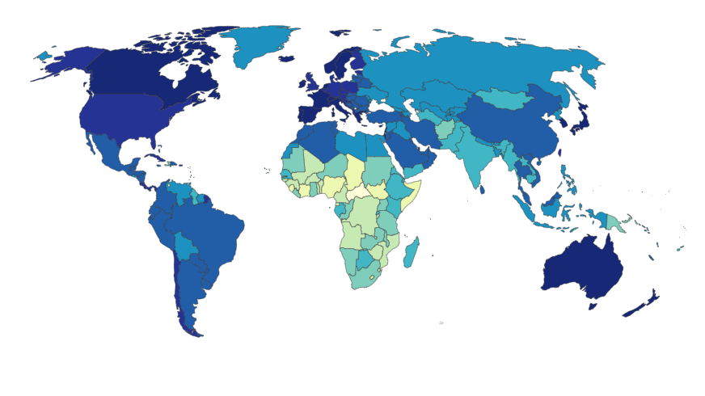
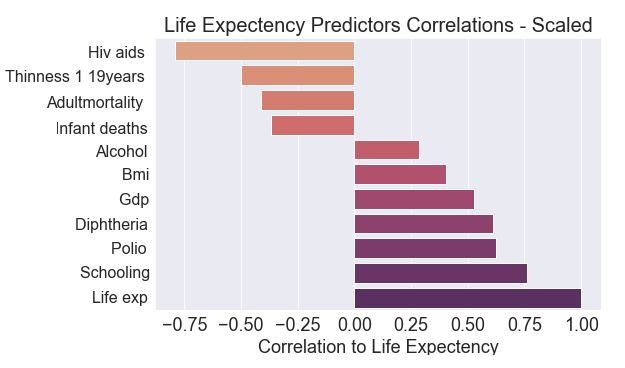
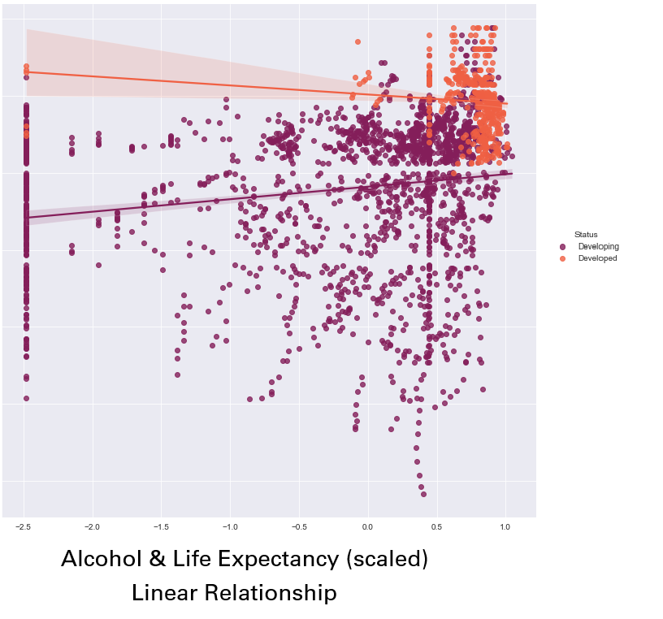

# Life Expectancy Prediction

## Business Problem 
A consultancy firm is hired by a government health department to provide insights on factors that influence life expectancy. This analysis will attempt to:
Predict life expectancy by examining positive and negatively correlated health and societal features of different countries. 
Serves as an example for countries to assess to improve life expectancy for their citizens.

## The Data 

The  World Health Organisation’s (WHO) Life Expectancy dataset was used for this analysis. 
The Global Health Observatory (GHO) data repository under WHO keeps track of the health, social, and economic factors for all countries. 
The publicly available dataset provides data for 193 countries spanning from 2000 to year 2015 and is structured in 2938 rows (data points) which are characterised into 22 columns (features). 

#### Features 
1. Country
2. Year
3. Status - Developed or Developing country
4. Life Expectancy – Age (years)
5. Adult Mortality - Probability of dying between 15&60 years per 1000 population
6. Infant Deaths - Number of Infant Deaths per 1000
7. Population of the country 
8. Alcohol- recorded per capita (15+) consumption (in litres of pure alcohol)
9. Percent Expenditure- Expenditure on health as a percentage of Gross Domestic Product per capita(%)
10. Hep B - Hepatitis B (HepB) immunization coverage among 1-year-olds(%)
11. Measles- number of reported measles cases per 1000 population
12. BMI - Average Body Mass Index of entire population
13. Under-5 Deaths- Number of under-five deaths per 1000 population
14. Polio- Polio(Pol3) immunization coverage among 1-year-olds(%)
15. Total Expenditure - government expenditure on health as a percentage of total government expenditure
16. Diphtheria- Diphtheria tetanus toxoid and pertussis (DTP3) immunization coverage among 1-year-olds(%)
17. HIV/AIDS- Deaths per 1000 live births HIV/AIDS(0-4 years)
18. GDP - Gross Domestic Product per capita (in USD)
19. Thinness 10-19 - Prevalence of thinness among children and adolescents for Age 10 to 19     
20. Thinness 5-9(%)- Prevalence of thinness among children for Age 5 to 9
21. Income Composition - Human Development Index in terms of income composition of resources(0-1)
22. Schooling- Number of years of Schooling

## Final Model & Important Predictors 
*Life_exp_scaled  ~  Schooling_scaled + Life_exp_scaled +  AdultMortality_scaled +   Infant_Deaths_scaled + Alcohol_log_scaled + BMI_log_scaled + Polio_log_scaled + Diphtheria_log_scaled + HIV_AIDS_log_scaled + Thinness_1_19Years_scaled + GDP_log_scaled*

## Recommendations & Insights 

The analysis has show that the most influetial predictors of life expetency are:  
1. Prevelance of HIV/AID 
2. Thinness among children and adolescents (i.e. underweight, possible lack of nutrition)
3. The number of years of education among the population. 

 

Based on these insights, recommendations to improve life expectancy include:
1. Prioritise HIV/AID prevention and education  
6. Invest in providing/subsidising food to new parents and children. Possibly provide free meals at schools. 
7. Invest in education 

### Other Insights 

## Questions for Future Analysis 

